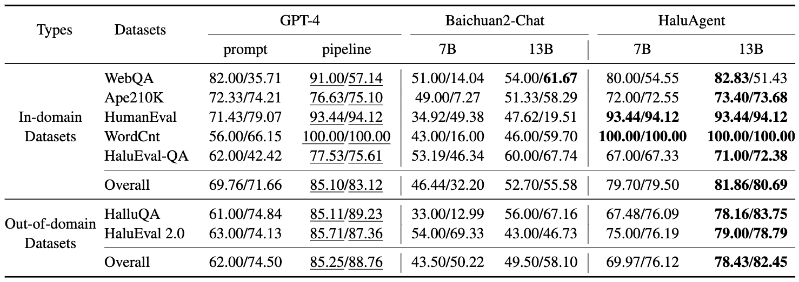

# Small Agent Can Also Rock! Empowering Small Language Models as Hallucination Detector

[arXiv Paper](http://arxiv.org/abs/2406.11277)

---

## Overview

In this paper, we propose an autonomous LLM-based agent framework, called **HaluAgent**, which enables relatively smaller LLMs (e.g. Baichuan2-Chat 7B) to actively select suitable tools for detecting multiple hallucination types such as text, code, and mathematical expression. In HaluAgent, we integrate the LLM, multi-functional toolbox, and design a fine-grained three-stage detection framework along with memory mechanism. To facilitate the effectiveness of HaluAgent, we leverage existing Chinese and English datasets to synthesize detection trajectories for fine-tuning, which endows HaluAgent with the capability for bilingual hallucination detection.

<p align="center">
    
</p>

## Trajectory Generation

We employ GPT-4 to generate hallucination detection trajectories following HaluAgent framework. HaluAgent first segments the input text into a set of semantically complete sentences, then selects tools to check each sentence individually, and finally reflects on the detection results to further correct mistakes. To support this process, we use memory mechanism to store useful information such as historical detection trajectories and current detection results. There are [2017 generated trajectories](./data/agent_trajectories.json) in total. The code for generating trajectories can be found in [generation](./haluagent/generation).

```bash
cd haluagent/generation
python traj_generate.py
```

## Fine-tune

We fine-tune Baichuan2-Chat to get HlauAgent. The fine-tuning code can be found in [finetune](./haluagent/finetune).

```bash
cd haluagent/fine-tune
bash run.sh
```

## Evaluation

HaluAgent can perform hallucination detection on various types of tasks and datasets. We conduct experiments on both in-domain and out-of-domain datasets. Below are the experimental results.

<p align="center">
    
</p

Here are the evaluation [code](./haluagent/evaluation) and [datasets](./data/test_datasets).

```bash
cd haluagent/evaluation
python traj_detection.py --model_path [model_path] --input [input_file] --output [output_file]
```

## Citation

If you find our work helpful for your research, please consider citing our work.

```bibtex
@article{cheng2024small,
  title={Small Agent Can Also Rock! Empowering Small Language Models as Hallucination Detector},
  author={Cheng, Xiaoxue and Li, Junyi and Zhao, Wayne Xin and Zhang, Hongzhi and Zhang, Fuzheng and Zhang, Di and Gai, Kun and Wen, Ji-Rong},
  journal={arXiv preprint arXiv:2406.11277},
  year={2024}
}
```
